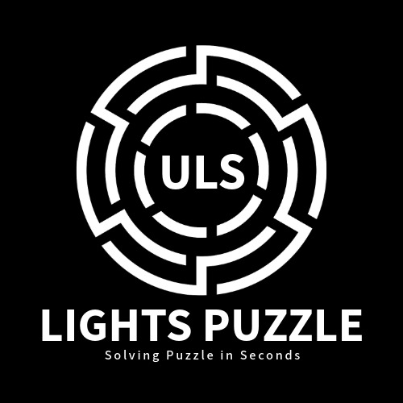

<h1 textcolor="red" align="center">Universal Light Puzzle Solver</h1>

<h3 align="center">How it works?</h3>

It works really simple, edit your puzzle and click solve, and just press pink dots! Done! Your puzzle is solved by algorithm.

<a href="https://www.dcode.fr/lights-out-solver"><h1 align="center">Click for Dcode Version</h1></a>